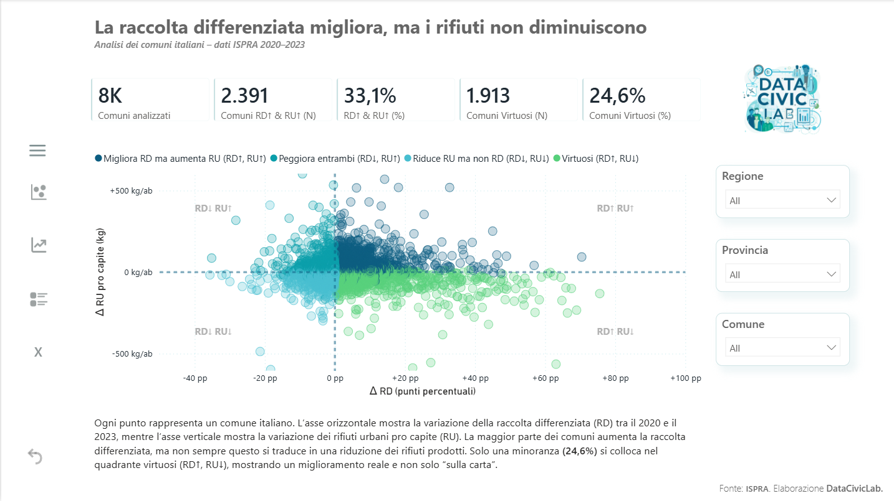
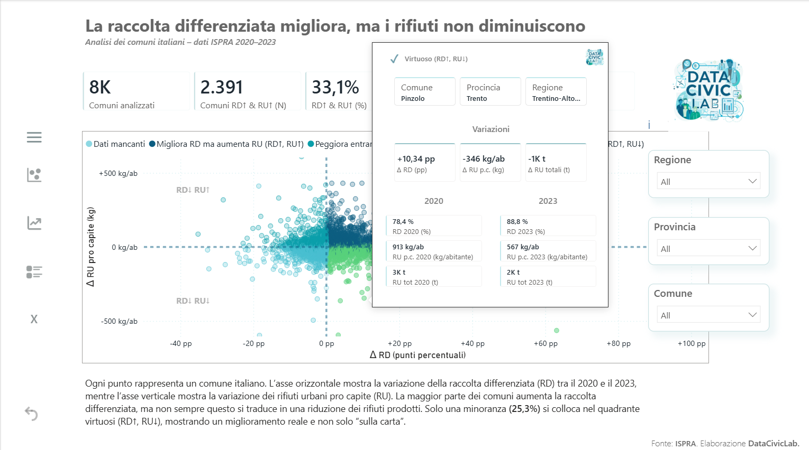
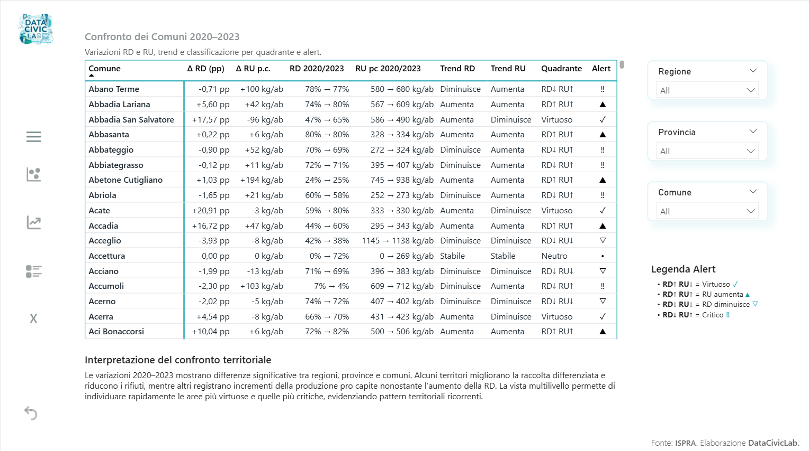

# 📊 Dashboard – Raccolta differenziata vs Rifiuti urbani (ISPRA)

Questa cartella raccoglie le informazioni sugli **output pubblici del progetto** (dashboard Power BI).

> **Nota:** qui non ci sono file dati.  
> Trovi invece **descrizione, screenshot e guida di lettura** della dashboard.

---

## 🎯 Risposta alla domanda civica

Ci sono comuni che migliorano la raccolta differenziata (%) ma aumentano i rifiuti totali?

- Sì.

L’analisi 2020–2023 evidenzia che: una quota rilevante di comuni registra un aumento della raccolta differenziata una parte di questi presenta però anche un aumento dei rifiuti urbani (pro capite o totali) esiste comunque un gruppo consistente di “virtuosi strutturali”, che migliorano la raccolta differenziata riducendo contemporaneamente i rifiuti pro capite.

La relazione tra RD e RU non è quindi automaticamente inversa: l’aumento della raccolta differenziata non implica necessariamente una riduzione dei rifiuti prodotti.

La dashboard consente di esplorare nel dettaglio questi comportamenti per territorio.

---

## 🖥️ Dashboard

**Tipo:** Dashboard (Power BI)  

**Link pubblico:** https://app.powerbi.com/view?r=eyJrIjoiZmE5MTNlZmItN2NkZC00ZTkyLWEwZGItMzE3ZWJkNzI0ZjZjIiwidCI6IjgwNjZmMmRlLTgxZDctNGVjNC04Y2E5LTgzNzVjOTA4NjViNSJ9

**Ultimo aggiornamento:** 15-02-2026

---

## Screenshots

## 🔎 Overview

## 🧮 Tooltip personalizzato

## 📈 Trend temporale + Top migliori e peggiori

## 📊 Confronto Comuni

---

### 🗂️ KPI principali
- Numero di comuni analizzati  
- Comuni RD↑ & RU↑ (N e %)  
- Virtuosi strutturali (N e %)  
- Mediana Δ RU pro capite (virtuosi)

---

## 🧭 Come leggere la dashboard

- **Asse X:** Δ Raccolta Differenziata (punti percentuali)  
- **Asse Y:** Δ Rifiuti Urbani pro capite (kg/abitante)  
- **Quadrante RD↑ RU↓:** miglioramento strutturale  
- **Alert (!!):** territorio critico (RD↓ RU↑)  
- **Frecce:** direzione del trend 2020 → 2023

---

## ⚠️ Limiti dell’analisi

- Analisi basata sulla variazione 2020–2023 (non serie lunga)  
- Non misura causalità tra RD e RU  
- I comuni con RU pro capite non valido sono esclusi dai calcoli percentuali  
- I dati ISPRA possono essere soggetti a revisioni ex post  

---

# 📌 Metodo

## 📦 Dataset utilizzati
Fonte: **ISPRA – Catasto Rifiuti**  
Periodo: **2019–2023** (analisi variazioni 2020–2023)

---

## 🏗 Costruzione del MART

Per ogni comune sono stati calcolati:

- Δ RD (punti percentuali)  
- Δ RU pro capite (kg/abitante)  
- Δ RU totali (tonnellate)  
- Classificazione quadrante  
- Flag “virtuoso strutturale”

### Definizione quadranti

| Quadrante | Significato |
|----------|-------------|
| **RD↑ RU↓** | Virtuoso strutturale |
| **RD↑ RU↑** | Migliora RD ma aumenta RU |
| **RD↓ RU↓** | Riduce RU ma peggiora RD |
| **RD↓ RU↑** | Critico |

---

## 📐 Scelte metodologiche

- Δ RD espresso in **punti percentuali (pp)**  
- Δ RU espresso in **kg per abitante**  
- Percentuali calcolate solo sui comuni con RU pro capite valido  
- Uso di `DISTINCTCOUNT` su `istat_comune_6`
- I delta sono calcolati come differenza 2023 − 2020

---

## ⚠️ Limiti dell’analisi (dettaglio)

- Non è un’analisi causale  
- L’aumento della RD non implica automaticamente riduzione RU  
- Il 2020 include effetti pandemia  
- I dati non considerano la qualità della raccolta  
- I comuni molto piccoli possono generare variazioni estreme in tonnellate  

---

## 🧠 Cosa si può dedurre

- Distribuzione territoriale dei comportamenti  
- Percentuale reale di miglioramento strutturale  
- Differenze regionali e comunali  
- Pattern di incoerenza tra RD e RU  

---

## 📂 Coerenza con i MART

La dashboard utilizza:

- `/data/mart/mart_comuni_delta_2020_2023.csv`  
- `/data/mart/serie_comuni_2019_2023.csv`

Lo schema è documentato nella cartella `/data`.

---

## 🏷 Versione

**v1.0 – Dashboard finale pubblica**  

---

